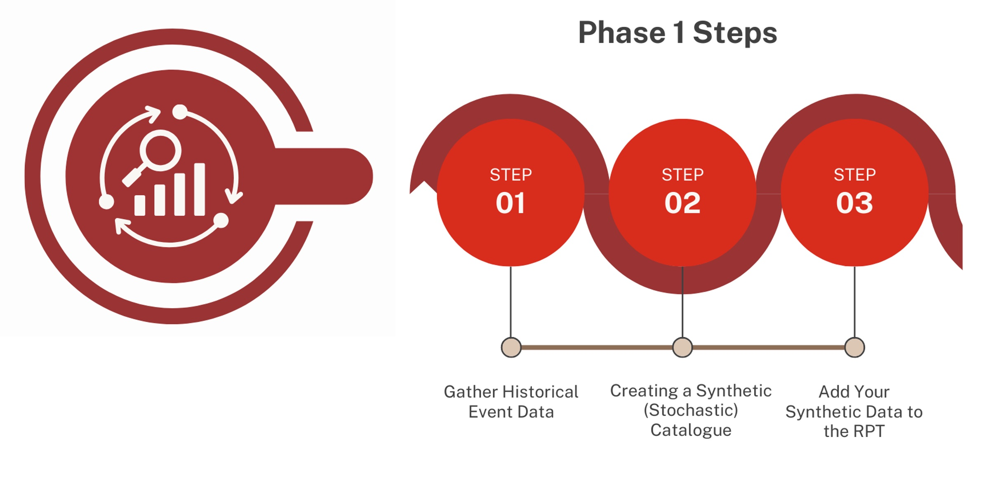
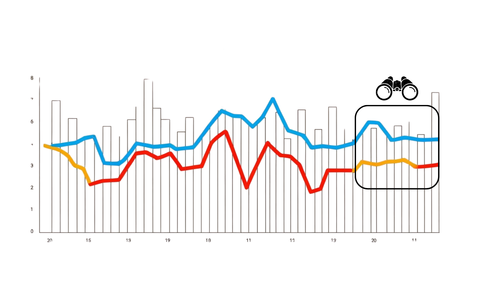

.. _phase1_reference-label:

Phase 1: Understanding the nature of the risks
==========================================================

Before adding risks to the pool and add funding coverage against them, there are a number of decisions or areas of understanding and prioritisation that have to be established outside of the tool and the calculation. 

**What risks should be covered financially and include in the pool?**
The risks to cover will likely be different for all organisations and will be dependent on several factors. This may be depend on the risks and impacts that a country has prioritised. It may include looking at the operational systems that are ready to utilise the money effectively in emergencies. How those country risks are identified will require decision-making criteria on those being prioritised for coverage. 

**Who has requested coverage and how much?** 
Firstly, there is likely to be a mechanism where those who would be utilising the pre-positioned disaster funding could request coverage support. Certain conditions may be in place for prepositioned funding coverage. These may be how effective and well-planned the delivery of support with the released funding is or potentially what existing financial coverage and support is already in place. How to consider those requests will depend on existing governance and requirements, which should be clarified for transparency.

**What type of coverage has been requested?** 
How much funding has been requested for different levels of risk needs to be considered in the financial structure. There may be preferences for more funding for different severity events, depending on the financial needs and gaps.

**What other funding coverage is in place for those risks?** 
Providing funding coverage from the pool for the entirety of the possible funding risk is unlikely. Often, a mixture of funding lines come in for different emergencies and at different severities. So, understanding the landscape in which the pool sits will be important before constructing the financial structuring. This will ensure the most efficient arrangement of funding for future crises is used. Having pre-arranged financing for a crisis also means that the corresponding emergency planning and operations will be incentivised to do the same. Chaotic financing systems often intersect in creating chaotic operational systems in disasters.

Step 1: Gather Historical Event Data
---------------------------------------

The first step is gathering data on past events for the risks to be included in the pool. This includes the perils and which countries were affected, in addition to impact metrics such as people affected or financial costs.

Guidance
""""""""""""""""""

**1. Identify which risks (hazard + country) to include in the risk pool:**

  Example: Zimbabwe – Drought. The risks included in the risk pool would receive guaranteed coverage if they occur in the future up to a pre agreed level of loss. 

**2. Build or locate a historical event catalog containing:**

  1. Year
  2. Country
  3. Peril (Hazard)
  4. Losses in US$ (any financial losses need to be converted to USD)

  Data sources could include public loss databases (e.g., `EM-DAT <https://public.emdat.be/>`_), records from local stakeholders, and in-house or external models. Working with local agencies and stakeholders to identify and validate past data on events is key. 

**3. Identify possible sources of error:**

  * Gaps in historical records
  * Currency, inflation or misreporting
  * Missing data for smaller events

**4. Compile for each country and hazard risk, a separate input Excel file:**

  A template is provided on `here on the Disaster Risk Pooling Tool GitHub <https://github.com/IDF-RMSG/DisasterRiskPooling/blob/develop/DisasterRiskPoolingTool/PoolingTool_UploadTemplate.xlsx>`_ (or `download directly <https://github.com/IDF-RMSG/DisasterRiskPooling/raw/refs/heads/develop/DisasterRiskPoolingTool/PoolingTool_UploadTemplate.xlsx>`_).
   
  An example of data is provided on `here on the Disaster Risk Pooling Tool GitHub <https://github.com/IDF-RMSG/DisasterRiskPooling/blob/develop/DisasterRiskPoolingTool/PoolingTool_UploadExample.xlsx>`_ (or `download directly <https://github.com/IDF-RMSG/DisasterRiskPooling/raw/refs/heads/develop/DisasterRiskPoolingTool/PoolingTool_UploadExample.xlsx>`_).

Key Decision-Making Considerations
""""""""""""""""""""""""""""""""""""""""

**What data is good enough to include in our catalogue?**
“Good enough” is a relatively subjective term, so it will be important to have criteria in which past disaster data is deemed of sufficient quality to be included in your catalogue. In some cases, larger events and hazards, such as earthquakes and cyclones, which have clearer infrastructural-based impacts, may be easier to cross-reference and verify and therefore have more confidence in the loss data. Events like droughts and food security impacts can be more difficult to understand and definitively quantify. There should be clear rationale on why different types and sources of data have been included or excluded from the catalogue. It is important that the depiction of risk is kept as true as possible, without augmentation to a preferred view of risk for financial considerations. This should be done later on within the financial structuring. 

**What are the key instances and likely sources of error and uncertainty in the event data?** 
Knowing what gaps and limitations exist within your base event catalogue will give you indications for each risk when the risk relationship depicted may be over or underestimating the risk due to those limitations. The likely reasons for this are essential to note and identify to help with the later management of uncertainties and basis risk operationally. 

.. admonition:: Fundamental Principle
 
    *Magnitude* refers to how big the event is - (this may be defined by the physical hazards, or the impact and losses - which are not the same), so make sure you know what kind of magnitude the data is showing you. 

    *Frequency* is how often that size magnitude event occurs. High magnitude events happen infrequently and low magnitude events happen more frequently. But the relationship between these variables will be different for each risk, location and circumstances. Understanding that relationship is the fundamental core to strategic risk management.

    *Climate Change* doesn't impact the day to day occurrences of events, but it does alter this magnitude frequency relationship over the long term. 

Now you have a database of past event information on the risks that the pool will cover. This will provide information about the magnitude and frequency of those events and the overall likely financial need in total those types of crises may require. However, it will likely need some improvements using statistical techniques. 

This is because, often, we will only have a small snapshot of those relationships and patterns, so we need ways to try to understand the broader relationship beyond the data we have for recorded events. The original dataset likely won't cover all potential events of interest (i.e. even rare ones that may occur once every 200 years) and therefore statistical techniques are used instead to re[resent what we can't see with our limited view. 

  
  Limited duration of event observation (boxed), and extension of that via stochastic simulation.

Step 2: Creating a Synthetic (Simulated) Loss Catalogue 
---------------------------------------------------------------

This step uses the online `Loss Simulator <https://idf-rmsg.shinyapps.io/DisasterRiskPooling>`_.

This step is about how to use that information and try to project and understand more deeply the statistical patterns and likely probabilities of different events overall – this uses the tool to support creating a set of synthetic (or simulated) events. This will generate from a relatively small number of event entries (e.g., historical loss records) into tens of thousands of events losses, representing wider variability and extreme losses that do not appear in the historical record.

It is often difficult to understand long-term pattern of disaster impacts and losses because we typically  have a short duration of past event data. In some cases, there might only have two or three events with reliable data on impacts and losses. To address this, it is typical to create a stochastic set of events to model their impacts, or to statistically simulate a catalogue of losses. This essentially uses the patterns of available data to simulate the impacts of other statistically possible events, creating tens of thousands of simulated events. This makes understanding the long-term pattern of those events more statistically robust. 

.. admonition:: Fundamental Principle

    **How reliable is our understanding of the magnitude frequency patterns?**
    Reviewing the quality of the event data available and the robustness of the distribution fitting will give decision-makers a clear idea of how reliable our knowledge of the magnitude frequency relationship is. This is important as the weight of the risk in the pool may be under or overestimated due to this. When it comes later on to assigning financial coverage to those risks, this would need to be a consideration alongside the nature of the risk depicted in the distribution. 

    There are two kinds of catalogs that can be inputted. These include historical catalogs, where the base data you are inputting has come from recorded historical events. The second are catalogs which have already been generated by a model. In this case you may be using the tool to align to the 15 thousand years of events that this tool provides, to check the curve fitting or to convert the output into the format needed for the Risk Pool Structuring tool.

  The Loss Simulator allows you to only run one type of input at a time. For example you cannot combine historical events _and_ modelled events for earthquake in Chile. 
You also cannot add both a modelled simulated catalog and an historic simulated catalog for the same country peril in the Risk Pool Structuring tool. Currently it is either or for each country's risk. However, if different risks and countries you can use a mixture in the Risk Pool Structuring Tool (i.e modelled simulation for drought in Mali and simulation based on historical data for flood in Colombia).

Guidance for using the Loss Simulator
"""""""""""""""""""""""""""""""""""""""""""""

1. Data Selection Tab

 Choose Advanced or Basic Input.
 Choose country from the drop-down list

 .. figure:: ../src_img/screenshots/step2_1_input.png
   :scale: 25%
   :alt: Data selection tab

   Data selection tab

 In advanced mode, upload your Excel/CSV file of historical events (completed in step 1). A graph of uploaded data appears at the bottom for validation.

 Set the cost per person you wish to set (this can be identified using the average loss per person in the historical loss (where both are available), or there may be an established cost per person you may be using or already established for the country and risk).

 Select the data type and the metrics which you would like to displayed on the chart. 
Events are shown on the chart only if the impact metric is non-zero in the historical loss catalogue. It is common for events to have a zero loss for Economic Damage and non-zero loss for people affected - therefore the number of events displayed will differ by impact metric selected.

**The metric type shown on this chart when you navigate to the next step (click 'Next'), will be the metric used in the rest of the analysis.**

.. admonition:: Fundamental Principal

   The more historical event data you have from historical catalogs, the more robust the simulations will be to give the view of risk and the magnitude/frequency relationship. If only a small number of historical event information data points are available, there will be significant uncertainty in your financial risk modelling. This uncertainty increases if events close to your later attachment/trigger points are not well represented. Exercise caution in these cases as it may not be sensible to include risks based on such small amounts of data in the pool because they may not capture the potential funding liabilities. 

 .. figure:: ../src_img/screenshots/step2_2_manual_input.png
   :scale: 25%
   :alt: Advanced .csv file upload

   Advanced .csv file upload

2. Scaling

 Choose from the drop down menu of the scaling and trending data you want to include in your data set - Population, inflations, GDP or no scaling. If manual input data is used, and does not attribute loss data to a specific year, it will not be possible to scale the losses.

 .. figure:: ../src_img/screenshots/step2_3_scaling.png
   :scale: 25%
   :alt: Scaling options

   Scaling options

 The graph now shows the de-trended results.

3. Simulation

 Click Run Tool (this could take up to 5 minutes).

 .. figure:: ../src_img/screenshots/step2_4_run.png
   :scale: 25%
   :alt: Run tool - click button

 In both Basic mode and Advanced mode the tool fits multiple statistical distributions for loss amount (severity) and selects the distribution with the best possible fit to the data. The severity distributions tested by default are Lognormal, Gamma and Weibull. In Advanced mode you can change the distribution selection - but it is advised to only do this with expert support. For frequency of losses the tool tests the Poisson distribution assumption that sample variance equals the mean. If this is true in the data, Poisson frequency is used but where variance is less than the mean then the Negative Binomial frequency distribution is used.

 The graph can display for each risk a display of the fitted distribution based on the observed data that was inputted, the simulated events through the model and both combined.

 .. figure:: ../src_img/screenshots/step2_5_simulations.png
   :scale: 25%
   :alt: Simulation options

   Simulation options

   
4. Outputs

 Select each risk to see the simulated losses.
 Toggle 95% confidence intervals to see the range of uncertainty at each return period.
 The tool also provides graphs and other exhibits (e.g., estimated annual losses, loss exceedance curves, tables of return periods, comparisons of distributions).
 You can input a budget value to generate 'graph 4' exhibit to identify the annual funding gap. 

 .. figure:: ../src_img/screenshots/step2_7_outputs.png
   :scale: 25%
   :alt: Simulation outputs

   Simulation outputs

 Download Simulations to save your new synthetic event catalog in the format needed for input into the Risk Pool Structuring tool (an Excel workbook).

 .. figure:: ../src_img/screenshots/step2_8_downloadsims.png
   :scale: 25%
   :alt: Download simulation outputs using the buttons
     
   Download simulation outputs using the buttons

Now you have a database of observed and simulated crisis events and their losses, from which the patterns of magnitude and severity can be better understood.
**Limitation: There is no consideration or estimation of correlation of losses between countries or perils in the Disaster Risk Pooling tool.**

In the next phase, you will add this data to the Risk Pool Structuring tool to explore the principles of structuring a risk pool.

Key Decision-Making Considerations
""""""""""""""""""""""""""""""""""""""""

**How many simulated events are enough?**
How many simulations you include will depend on the computing power you have and also the number of events you are basing that simulation on. If like in the example, you only have 3 events with data. Running 20,000 events is likely going to be highly uncertain, so perhaps less is more in that case. A statistician or actuary would help you make a sensible choice.

**What scaling to apply?**
Here, it will consider what other changes happened alongside this data, which might influence the data and the objectivity of that pattern you are trying to understand. This can include population changes, price and cost changes with inflation. Once those trends are identified, the data related to them can be included to have those associated patterns in the data removed. 

**What statistical distributions will be used to generate the synthetic catalogue?**
There are many different shapes of curves that can be plotted through the graph of the catalogue to try and discern most accurately the related pattern of magnitude and frequency of that risk. A statistician will look at different options to fit a curve. Usually, there will be no one perfect obvious pattern, so there will be trade-offs on which distribution is selected. Understanding the implications of those trade-offs in that decision would need to be understood by decision-makers where there may be over or under-estimates at different parts of the risk relationship.

**What level of statistical uncertainty do we have?**
How well the selected distribution fits the data will generate uncertainty, where the best fit is made. Statisticians will look to minimise the uncertainty as much as possible, but as with all things, this can only be minimised. Decision-makers will need to know, understand, and accept this. 

 
  

