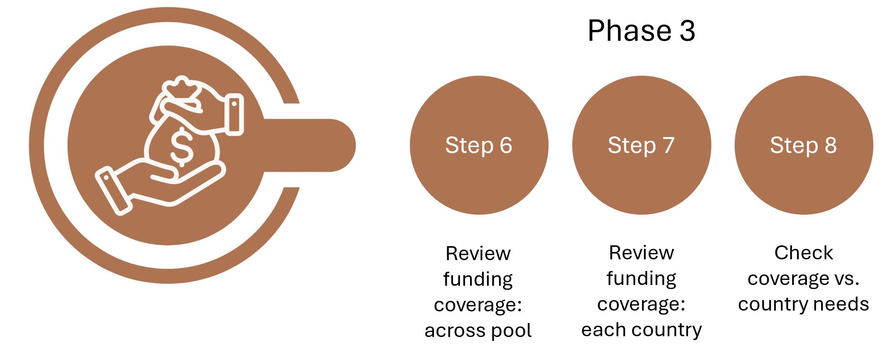

.. _Phase3_reference-label:

Phase 3: Country risk - financial analysis
==========================================================

Once your pool analysis has run, you can review the pre-arranged funding arrangement for each country risk. This can give you a view of the coverage you have set up and how this looks in relation to the overall volume of risk for that country-peril. 

Step 6: Review Funding Coverage across the risk pool
-----------------------------------------------------

On the Financial Structure visualisation tab you can view how the coverage layers look in the context of the overall country risk. 

 .. figure:: ../src_img/screenshots/step6_countryDrivers.png
   :scale: 25%
   :alt: Phase 3 steps 

   Financial Structure visualisation tab (Click to enlarge image)

Guidance
""""""""""""""""
1. Select the country and risk in cell DI5.

2. Scale the visualisation by selecting minimum and maximum return periods to show.

3. The total volume of the box area is the total country peril risk for the selected return periods: 
 * Layer 1 coverage is in light orange. 
 * Layer 2 coverage in darker orange. 
 * The blue area is the financing, risk and number of people not covered by a pre-agreed financial structure (i.e., a layer). This may be where other actors financing comes in, in risk financing coordination. It may also be where there is no pre-positioned financing resulting in uncovered risk (a protection gap), this uncovered risk is usually borne by governments, or individuals and households.  

Note: 
 If you can't see the layers it may be that you need to adjust the scale to the right position of where you set the coverage (Cells DF8 and DG8). 

On the left of the sheet you can expand columns A to D. This gives you all the detail of the risk profiles for each layer, so you can see where your current structure sits and if you might want to adjust when you later optimise in step 5

Step 7: Review Funding Coverage for Each Country
-----------------------------------------------------

Review the coverage and risk profile of each country you have in your risk pool and the risk profiles that have been entered into the sheet. 

 .. figure:: ../src_img/screenshots/step7_countryLossAnalysis.png
   :scale: 25%
   :alt: Country Loss Analysis

   Country Loss Analysis (Click to enlarge image)
 

Guidance
""""""""""""""""

1. Go to the Country Loss Analysis sheet.

2. Select a country in cell A6.

3. Define Event Type in cell D6: select “Event” if you want the analysis to look at the data event by event or select “Yearly” to group together all events that happen in a year. 

4. The sheet displays a graph of the losses by percentile and the accompanying.

5. Adjust the graph scale in in cells A11, B11, D11 and E11. 

6. Review the total country loss for all of the risks for that country (red line) and loss to layer 1 (yellow solid line) and layer 2 (blue solid line).

7. The dashed lines display the excess and limit of each of the layers.

8. Attachment and exhaustion points for the layers is shown in cells I16 to M17 ('Layer Summary' table). 

9. The 'Return Period Summary' table (cells I21 to N28) shows total country loss and loss per layer for selected key event return periods or frequencies. The term 'loss' is used as these are losses from the country and from the layers of funding, but you can also think about it as the total financial requirement for those size events. You can also think of the 'layer losses' as the payouts from the layers needed to cover your part of the risk. 

10. The table (not shown in image above) at the bottom provides the more detailed granulation of the data provided in the graph and previous tables. 

Step 8: Check Coverage vs. Operational Needs
--------------------------------------------------

Reviewing the graph displayed for each country risk you may also need to consider the following decisions outside of the tool. 

Key Decision-Making Considerations
""""""""""""""""""""""""""""""""""""""""

**Who is covering the risk below the attachments and above the exhaustion?**
You can see from the graphs there are gaps and areas in blue that there either isn’t coverage for or may be covered by other emergency funding. Below the lowest layers attachment will be the risks which will be happening regularly but likely will be lower costs to respond to. This may be where you might assume that more sub-national, localised, and individual resources would come into play, and so wouldn’t need emergency coverage. Having knowledge of what this level might look like is important to think carefully about those attachment points and when the need for emergency financing may come into play. You may also want to consider in the very worst crisis what your gap in funding might be. 

**How might the funding be allocated over the phases of the crisis?**
Each of the funding releases could also be utilised in different phases of a crisis for various objectives. For example, it might be triggered ahead of a crisis based on early warning data to try to increase preparedness, on impact for response or to recover and rebuild post-event. Considering what the funding will be used for and how it may be spread or phased operationally is also an essential consideration in the financial coverage. This can be considered matrix financing, with horizontal severity layers and vertical time windows of crisis. Some prepositioned funding will be expected to cover all phases, while others may be prioritised into specific window such as an anticipatory window or only for recovery.
