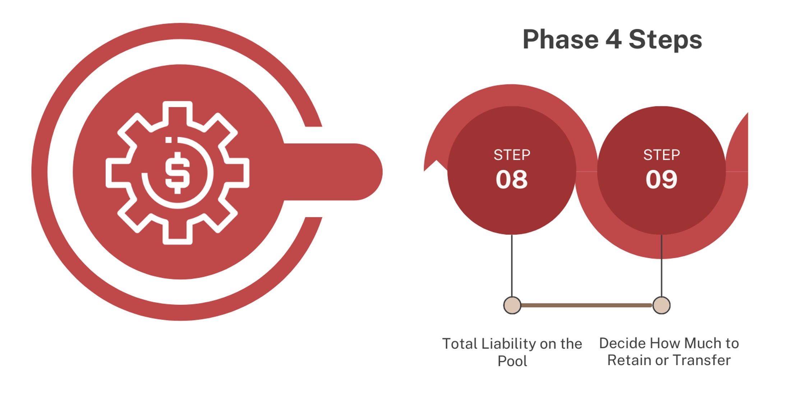

.. _Phase4_reference-label:

Phase 4: Emergency funding pool - financial analysis
==========================================================

Step 9: Total Liability on the Pool
---------------------------------------

The tool has now calculated the probabilities of large volumes of scenarios of payouts from  Layer 2 and combined all of the financial requirements and probabilities from the combined statistical distributions and financial structuring. You can now see the overall combined risk curve for all of the risks. 

Guidance
""""""""""""""""""

1. Go to the Pool Analysis Tab to show a “combined payout” scenario when all country-risks are included in Layer 2.

2. The chart 'Pool Loss Contribution by Region-Peril' indicates which country-peril combinations dominate the pool liability, showing which combinations are most likely to pay out, and draw down the funding most heavily (the bigger the share, the heavier the draw down from the pool). The heavier risks could be a result of lots of funding being pre-positioned for that risk,  the number of reinstatements on those risks, or the frequency and severity of the events included in that country-peril combination, if the attachment and exhaustion is high. 

3. The table in cells A23 to C23 displays the percentage share of each risk in the pool and the annual average loss (or payout) for that risk. 

 .. figure:: ../src_img/screenshots/step8_totalLiability.png
   :scale: 25%
   :alt: Total liability on the pool

   Total liability on the pool

Step 10: Decide How Much to Retain or Transfer
------------------------------------------------

The graphs highlight how to structure the pool to be efficient with the funding available, and if (and how) to apply risk transfer, as a Layer 3. Risk transfer or Insurance can provide access to funding for the biggest losses or payouts from layer 2, without having to hold it in layer 2.

It can be difficult to justify holding large amounts of money in case a rare event (with a small probability of occurring) happens, when there are needs in so many other places. However, there is still a need to ensure that if those events do occur, there is access to enough funding for response and recovery. To ensure this, some risk can be transferred each year by paying a "premium" upfront to transfer the risk, which means someone else will hold enough funding to cover those events for an agreed period of time through insurance. Insurance is cost effective if covering rare events with low probabilities and managing its financial risk across much larger diverse global pools of risks.

**Note: The Disaster Risk Pooling tool does not enable premium amounts to be entered, so does not support full pricing estimation.**

Premiums increase when there is a higher likelihood that an insurance company will have to pay a claim. So it becomes less cost effective to transfer risk with lower return periods (or higher probability of loss). The most uninsurable risk would be a high payout that happens frequently, but these losses can be covered with layer 1 and 2 -  these layers and instruments should be financially and operationally efficient to ensure impact and predictability, but don't need to be profitable for insurance markets.

This is at the heart of why financial layering is so useful for disaster management: it allows money for crises to flow efficiently and be operationally impactful. It can create predictability in funding which is very important for good disaster management and preparedness systems. 

The images below illustrate these concepts.

 .. figure:: ../src_img/guidanceimg/GlobalInsPool.png
   :scale: 20%
   :alt: Schematic of a risk pool with insurance
  
   Schematic of a risk pool with insurance

 .. figure:: ../src_img/guidanceimg/retentionToTransfer.jpg
   :scale: 25%
   :alt: Retention and Risk transfer layers
  
   Retention and Risk transfer layers

Guidance
""""""""""""""""""

1. Cell I6 allows you to vary the standard deviation, which represents the insurance premium cost in the tool. 

.. admonition:: Fundamental Principal

   The standard deviation gives a 'rule of thumb' method for loading a premium amount. However, how each individual insurance company arrives at a premium will be   different - there is no consistent approach to price risk. Risk Premium will depend on a huge number of factors at the time, including what else is going on in the global market and a companies' own risk appetite and cost of capital. This is why it is important to get different quotes for coverage. **Note: THe Disaster Risk Pooling tool does not enable premium amounts to be entered, so does not support full pricing estimation.**

2. All of your parameters for the pool will have been automatically generated in the table in cells I9 to P9.

3. You now have the option to add in layer 3 - Reinsurance of the pool. Starting in Cell I10. Here you can add in a value for the total amount of coverage you would want from reinsurance. 

4. The total pool loss (expected payout total) is found in cell J9. The total funding needed is the total pool loss plus the standard deviation premium amount and the expected loss - this is found in P9. The same parameters are set for Layer 3 automatically. 

5. The graph 'Pool and Reinsurance Losses' displays the overall pool loss curves, with all of the combined risks:
 * Combined losses for all of the country risks in the pool (orange line) 
 * Loss from the pool (grey area of the second plot line) 
 * Exhaustion amount of the pool funding (yellow dotted line)
 * Reinsurance attachment point (solid blue line) and exhaustion (dotted blue line)
 * Pay out from insurance (green line)

6. The graph can be scaled in cells H27 to L27.

 .. figure:: ../src_img/screenshots/step9.png
   :scale: 25%
   :alt: step9.png

.. admonition:: Fundamental Principal

    Solvency: you can now see from the graph how solvent your financial structure is. The percentile where all three layers have been exhausted is the % of risk you have decided to retain that you won't have enough funding to cover all of the potential losses (payouts). For commercial insurance their structures have to be solvent 1 in 200 year loss events as part of financial regulations for insurance companies. However this does not apply to other non commercial funding mechanisms.

    Balancing priorities: When using risk financing and structuring for emergency support, it can run counter intuitively to insurance and commercial structuring. In emergency management we want to payout as much as possible when needed, insurance companies don't want that as a business model. So if you want to be very solvent, this will reduce the amount of risk you are taking but also reduce the amount of coverage you can offer to countries' - basically you hold together the money. If you allow for high levels of risk of insolvency, you may be able to offer higher levels of funding coverage and bigger payouts, but the risk of not having the money to meet that is much higher. A governance decision is required to decide this balance and to agree and hold the remaining risk. 

 Note: Any country provided coverage under the risk pool should be clearly informed of the solvency of any prepositioned financing that they rely upon in the different layers.  

   
7. The Pool Recoveries table from cell H48 displays all of the granular data from the graph. This may be helpful when it comes to optimising in the final step.

Key Decision-Making Considerations
""""""""""""""""""""""""""""""""""""""""

**What level of insolvency are we willing to accept?** 
If you are operating an insurance company, your aim is to be as fully solvent as you can be while ensuring affordable premiums. For the market, this is regulated, with having to be solvent to 99.8% (a 1-in-200 year return period). However, in the case of an emergency fund, you need to balance how safe the fund is and how to maximise its utility and employment in emergency situations. In this case, the risk appetite may be greater for emergency funds as holding onto too much funding can have significant moral and operational hazards in the context of emergency funding. 
A balance on how much to hold, transfer, and accept insolvency will dictate the level of funding that will likely flow out of your pool each year (annual average loss). All of the operational, governance, and technical considerations have to be considered in the round. 

**Do we have other means other than re-insurance to self-insure?** 
In some cases, you may have other funds or parts of funds that you can use as your backup in those very unlikely extreme years of drawdowns beyond the amount of funding you have. What availability and agreement you could put in place for this would need to be identified.

**What are the consequences if we cannot pay the total amounts we have guaranteed to countries?** 
This will differ with different funds. The predictability that risk financing and risk pooling bring is one of the biggest impacts and advantages in emergencies and funding mechanisms. So, it will be important to understand what level of guaranteed funding recipients are comfortable with and the level of risk they can accept. In some cases, you may have a legal contractual obligation, so understanding what level of guarantee and solvency you have agreed to is essential, along with clauses. Retaining funds for rarer events might be inefficient. Reinsurance (Layer 3) can transfer these “tail risks” for a premium.

