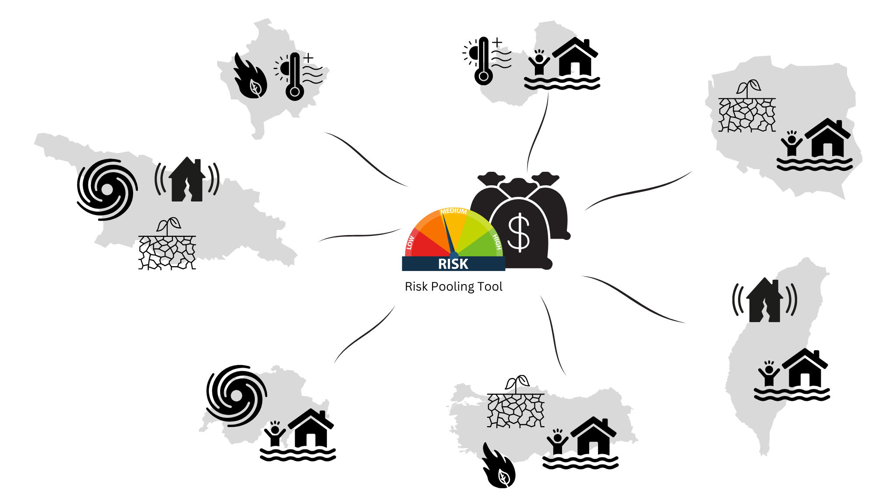
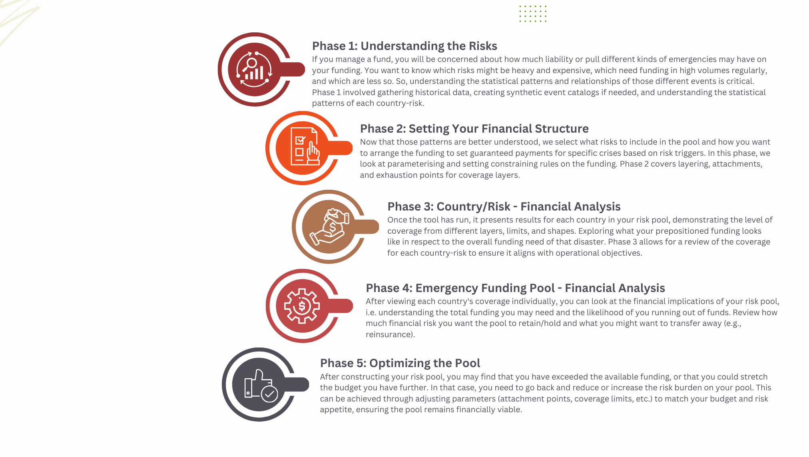

Financial Risk Pooling tool
====================================================

Introduction 
--------------------

The Financial Risk Pooling tool is an educational tool developed by the `Insurance Development Forum <https://www.insdevforum.org/>`_  in partnership with `Maximum Information <https://www.maxinfo.io/>`_ and the `World Bank Disaster Risk Financings and Insurance Program <https://www.worldbank.org/en/programs/disaster-risk-financing-and-insurance-program>`_.  

This is a free and open-source tool with code available on the `GitHub repository <https://github.com/idf-rmsg/FinancialRiskPooling>`_. 

The Financial Risk Pooling tool introduces how to model and structure financial risk for a disaster fund covering multiple hazards (e.g., floods, droughts, earthquakes).

The central purpose of this tool is educational, serving as an introduction to the different considerations that go into modelling financial risk within funds. The tool demonstrates how the processes of risk pooling and funding can be structured efficiently and responsibly even with events being highly uncertain year to year.

By illustrating how risk pooling and funding can be set up with well-defined payouts, the tool demonstrates how to:

* Put in place pre arranged financing for multiple disaster risks.
* Increase efficiency in the use of funding.
* Provide positive incentives for preparedness, planning, and partnership-building at all levels.
* Enhance accountability and transparency in how emergency funds are allocated and used.

.. admonition:: External guidance on setting up disaster risk financing systems
   
   Start Networks resources on designing and implementing disaster risk financing systems: `Disaster Risk Financing | Start Network <https://startnetwork.org/funds/disaster-risk-financing>`_ 

   World Food Programmes case studies and resources: `Publications | World Food Programme <https://www.wfp.org/publications?f%5B0%5D=topics%3A2214>`_

   Anticipation Hub resources on Disaster risk financing for humanitarian action: `Disaster Risk Financing and Anticipatory Action - Anticipation Hub <https://www.anticipation-hub.org/learn/emerging-topics/disaster-risk-financing/>`_

   World Bank case studies and resources: `Disaster Risk Finance | GFDRR <https://www.gfdrr.org/en/disaster-risk-finance>`_

The tool guides those responsible for emergency fund allocations to take them through the steps of constructing structured disaster financing, exploring what decision-making is needed both outside of the tool and what the tool and technical calculations can support in terms of understanding.

  

This documentation walks through each phase of setting up and optimising a risk pool, highlighting:

* Off-tool decisions (governance decisions, priorities, data choices).
* Tool-supported calculations (probability calculations, risk probabilities, coverage modelling).

Overview of Phases 
--------------------

**Phase 1: Understanding the Risks:**

If you manage a fund, you will be concerned about how much liability or pull different kinds of emergencies may have on your funding. You want to know which risks might be heavy and expensive, which need funding in high volumes regularly, and which are less so. So, understanding the statistical patterns and relationships of those different events is critical. Phase 1 involves gathering historical data, creating synthetic event catalogs if needed, and understanding the statistical patterns of each country-risk.

**Phase 2: Setting Your Financial Structure:**

Now that those patterns are better understood, we select what risks to include in the pool and how you want to arrange the funding to set guaranteed payments for specific crises based on risk triggers. In this phase, we look at parameterising and setting constraining rules on the funding. Phase 2 covers layering, attachments, and exhaustion points for coverage layers. 

**Phase 3: Country/Risk - Financial Analysis:**

Once the tool has run, it presents results for each country in your risk pool, demonstrating the level of coverage from different layers, limits, and shapes. Exploring what your prepositioned funding looks like in respect to the overall funding need of that disaster risk. Phase 3 allows for a review of the coverage for each country-risk to ensure it aligns with operational objectives.

**Phase 4: Emergency Funding Pool - Financial Analysis:**

After viewing each country's coverage individually, you can look at the financial implications of your risk pool, i.e. understanding the total funding you may need and the likelihood of you running out of funds. Review how much financial risk you want the pool to retain/hold and what you might want to transfer away (e.g., reinsurance).

**Phase 5: Optimising the Pool:**

After constructing your risk pool, you may find that you have exceeded the available funding, or that you could stretch the budget you have further. In that case, you need to go back and reduce or increase the risk burden on your pool. This can be achieved through adjusting parameters (attachment points, coverage limits, etc.) to match your budget and risk appetite, ensuring the pool remains financially viable.

.. toctree::
   :maxdepth: 3
   :caption: Contents:

   ../components/index_phase1.rst
   ../components/index_phase2.rst
   ../components/index_phase3.rst
   ../components/index_phase4.rst
   ../components/index_phase5.rst
   ../components/index_Conclusion.rst

