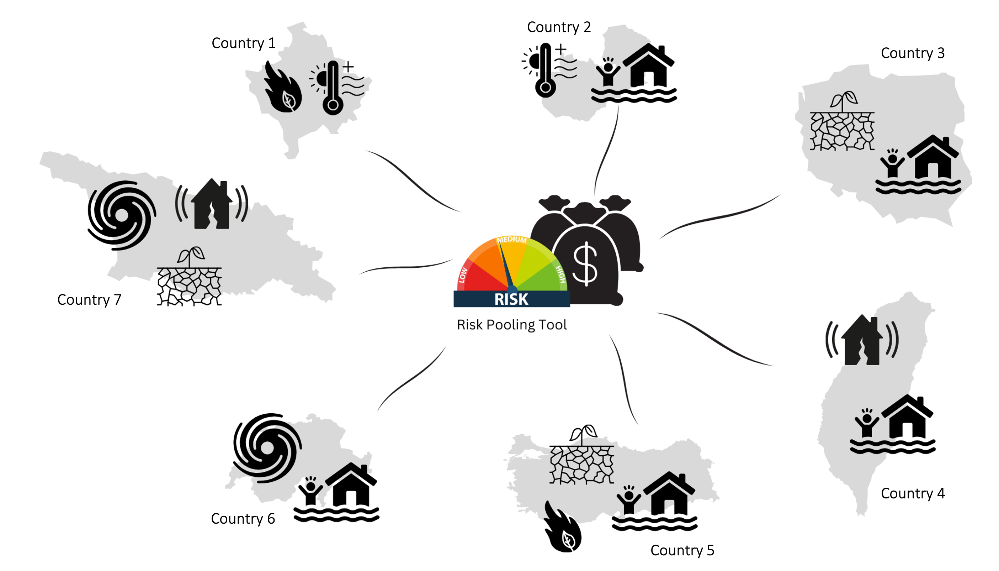
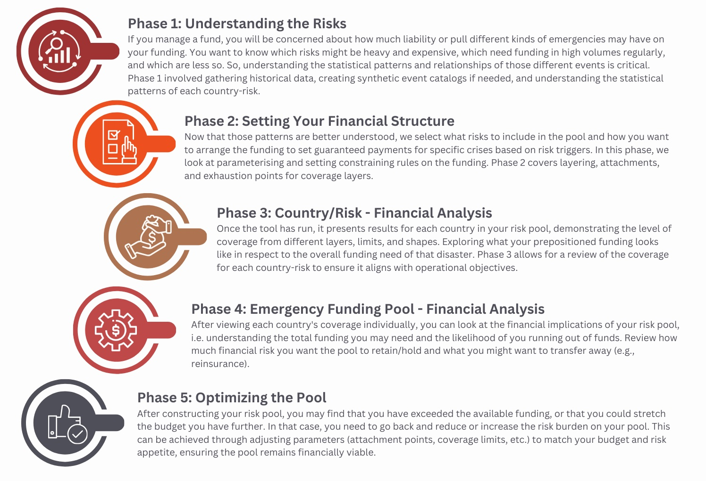

Disaster Risk Pooling tool
====================================================

Introduction 
--------------------

The Disaster Risk Pooling tool is an educational tool developed by the `Insurance Development Forum <https://www.insdevforum.org/>`_  in partnership with `Maximum Information <https://www.maxinfo.io/>`_ and the World Bank Group's Finance, Competitiveness & Investment team.  

This is a free and open-source tool with code available on the `GitHub repository <https://github.com/idf-rmsg/DisasterRiskPooling>`_. 

The Disaster Risk Pooling tool introduces how to model and structure financial risk for a disaster pool covering multiple hazards (e.g., floods, droughts, earthquakes) and multiple geographies.

The central purpose of this tool is educational, serving as an introduction to the different considerations that go into modelling financial risk within funds. The tool demonstrates how the processes of risk pooling and funding can be structured efficiently and responsibly even with events being highly uncertain year to year.

By illustrating how risk pooling and funding can be set up with well-defined payouts, the tool demonstrates how to:

* Put in place a pre-arranged financing instrument for multiple disaster risks.
* Increase efficiency in the use of funding.
* Provide positive incentives for preparedness, planning, and partnership-building at all levels.
* Enhance accountability and transparency in how emergency funds are allocated and used.

.. _ExtGuidance_reference-label:
.. admonition:: External guidance on setting up disaster risk financing systems
   
   Start Networks resources on designing and implementing disaster risk financing systems: `Disaster Risk Financing | Start Network <https://startnetwork.org/funds/disaster-risk-financing>`_ 

   World Food Programmes case studies and resources: `Publications | World Food Programme <https://www.wfp.org/publications?f%5B0%5D=topics%3A2214>`_

   Anticipation Hub resources on Disaster risk financing for humanitarian action: `Disaster Risk Financing and Anticipatory Action - Anticipation Hub <https://www.anticipation-hub.org/learn/emerging-topics/disaster-risk-financing/>`_

   World Bank case studies and resources: `Disaster Risk Finance | Global Facility for Disaster Reduction and Recovery <https://www.gfdrr.org/en/disaster-risk-finance>`_ and `Financial Protection Forum <https://www.financialprotection.org/>`_

The tool guides those responsible for emergency fund allocations to take them through the steps of constructing structured disaster financing, exploring what the tool and technical calculations can support in terms of understanding and the additional decision-making required.

  
  Risk Pooling Tool combining risks across multiple perils and geographies

This documentation walks through each phase of setting up and optimising a risk pool, highlighting:

* Off-tool decisions (governance decisions, priorities, data choices).
* Tool-supported calculations (probability calculations, risk probabilities, coverage modelling).

Overview of Phases 
--------------------

**Phase 1: Understanding the Risks:**

Those managing a risk pool want to understand the liability that different kinds of emergencies put on the funding. It is important to know which risks might be heavy and expensive, which need funding in high volumes regularly, and which are less so. So, understanding the statistical patterns and relationships of those different events is critical. Phase 1 involves gathering historical data, creating synthetic event catalogs if needed, and understanding the statistical patterns of each country-risk.

**Phase 2: Setting Your Financial Structure:**

Now that those patterns are better understood, the user can select what risks to include in the pool and how you want to arrange the funding to set guaranteed payments for specific crises based on risk triggers. In this phase, we look at parameterising and setting constraining rules on the funding. Phase 2 covers layering, attachments, and exhaustion points for coverage layers of the pool. 

**Phase 3: Country/Risk - Financial Analysis:**

Once the financial structure has been set and the tool run, it presents results for each country in the user's risk pool, demonstrating the level of coverage from different layers, limits, and shapes. This allows you to compare the amount of prepositioned funding compared to the overall funding need and any gap in funding, or "protection gap". Phase 3 allows for a review of the coverage for each country-risk to ensure it aligns with operational objectives.

**Phase 4: Emergency Funding Pool - Financial Analysis:**

After viewing each country's coverage individually, the user can look at the financial implications of the risk pool in totality, i.e. understanding the total funding needed and the likelihood of running out of funds. The user can review how much financial risk the pool should retain and how much it should transfer (e.g., via reinsurance).

**Phase 5: Optimising the Pool:**

After constructing the risk pool, the user may find the needs have exceeded the available funding, or that the budget could have stretched further. In that case, the user can go back and adjust the risk burden on your pool by changing the risks included in the pool, or adjusting parameters (attachment points, coverage limits, etc.) to match the available budget and risk appetite, ensuring the pool remains financially viable.

.. toctree::
   :maxdepth: 2
   :caption: Contents:

   ../components/index_phase1.rst
   ../components/index_phase2.rst
   ../components/index_phase3.rst
   ../components/index_phase4.rst
   ../components/index_phase5.rst
   ../components/index_Conclusion.rst

